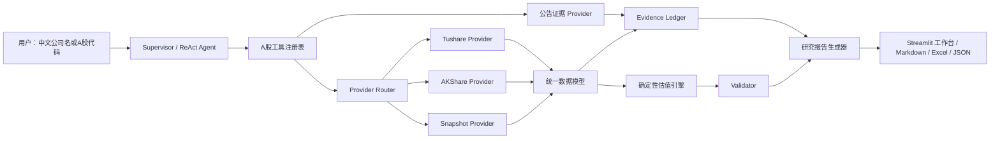

# FinTrace-CN：A股可验证金融研究 Agent 一个月二次开发方案

> 基于 `Agentic-Analyst/stock-analyst` 的二次开发规划  
> 方案日期：2026-08-08  
> 目标：在一个月内完成一个可运行、可验证、可演示、适合实习投递的 A 股金融分析项目，而不是简单替换数据接口或修改项目名称。

---

## 1. 最终开发方向

项目建议正式定位为：

**FinTrace-CN —— 面向 A 股的可验证金融研究 Agent。系统通过国产大模型进行任务理解和工具编排，通过确定性 Python 引擎完成财务指标、同行估值和风险校验，并为关键数字保留数据来源、报告期、单位、获取时间和计算过程。**

一句话卖点：

> 不让大模型“猜”估值，而是让 Agent 找数据、Python 算结果、Validator 查错误、Evidence Ledger 证明答案从哪里来。

项目的核心不是“把 yfinance 换成 AKShare”，而是完成以下三层改造：

1. **A 股原生化**：支持中文公司名、沪深京代码、人民币、A 股财报口径、交易状态和公告来源。
2. **可验证化**：关键数字可追溯，估值由 Python 确定性计算，报告结论能回指原始数据和公式。
3. **可评测化**：在线数据可保存为快照，离线可重复运行，能比较修改前后工具路由和数字正确率。

不建议把“预测涨跌”“量化交易”“自动选牛股”作为主线。这些功能很难在一个月内形成可信证据，容易在面试中被追问数据泄漏、回测偏差和收益承诺。项目应明确声明：**只做研究辅助，不构成投资建议，不接券商账户，不执行交易。**

---

## 2. 当前仓库真实状态与问题诊断

### 2.1 已经完成的能力

当前分支不是原始上游的空白版本，已经完成一轮二次开发：

- 当前仓库 `origin` 指向个人仓库 `FinTrace-CN`，`upstream` 指向原项目。
- 当前提交已有标签 `deepseek-integration-v1`。
- DeepSeek Flash 已成为默认模型，模型注册、OpenAI-Compatible 调用、成本统计和集成测试已经存在。
- `python main.py --list-llms` 与动态模型列表已经实现。
- 当前离线测试结果：**108 passed，3 skipped**。
- 现有主流程包括财务数据、财务模型、新闻分析、报告生成以及通用 ReAct 工具调用。
- 项目已有 Excel DCF 模型生成能力，这是可复用的差异化资产，不应推倒重写。

因此，参考 Word 中的八周路线时，应把“第四批 DeepSeek 接入”视为已经完成，而不是再次占用第一周。

### 2.2 截图报错的真实原因

截图中的核心异常是：

```text
yfinance.exceptions.YFRateLimitError: Too Many Requests. Rate limited.
curl https://query1.finance.yahoo.com/... -> Too Many Requests
```

这说明请求已经到达 Yahoo，但被限流。它不等于“只要设置代理就能修好”，原因可能同时包括：

- Yahoo 对 IP、Cookie、User-Agent 或请求频率进行限制；
- `yfinance` 多个工具分别请求价格、公司信息、新闻和财务报表，容易重复访问；
- 国内网络访问 Yahoo 不稳定；
- 重试机制如果没有全局限速和缓存，反而会加重限流。

结论：**代理只能作为可选网络配置，不能继续作为核心架构的前提。** A 股主路径中应彻底取消对 Yahoo 的强依赖。

### 2.3 当前代码中的关键耦合点

| 位置 | 当前行为 | A 股改造问题 |
|---|---|---|
| `main.py` | 初始化时直接通过 `yf.Ticker(...).info` 获取公司名 | 系统启动就可能因 Yahoo 失败，必须改为 Provider 查询 |
| `src/financial_scraper.py` | 财务三表直接绑定 `yfinance.Ticker` | 无法表达 A 股合并报表、报告期、币种和字段映射 |
| `src/agents/tools/data_tools.py` | 代码搜索、价格、技术指标、新闻主要依赖 yfinance | 中文公司名和 A 股代码体验差，且所有轻量工具都受 Yahoo 限流影响 |
| `src/agents/tools/capital_markets_tools.py` | 风险指标和组合数据依赖 yfinance | 计算逻辑可保留，数据读取层必须替换 |
| `src/article_scraper.py` | 依赖海外搜索与网页抓取 | 国内可用性、版权、反爬和证据稳定性不足 |
| `requirements.txt` | `vynn-core` 通过 GitHub URL 安装 | 国内首次安装仍可能卡在 GitHub，必须可选化或本地替代 |
| prompts | 以英文 ticker、美股和 Yahoo 语境为主 | 需要补充中文名称、A 股代码、财报口径和风险声明 |

### 2.4 当前工作区注意事项

当前已有未提交修改：`.env.example`、`main.py` 和 `src/agents/supervisor/supervisor.py`。后续开发前应先确认这些改动的用途并单独提交。`supervisor.py` 当前主要表现为换行符变化，导致 Git 显示近 1900 行修改及大量 trailing whitespace；建议先做一次换行符规范化提交，避免后续真实 diff 被噪声淹没。

---

## 3. 一个月 MVP 的范围

### 3.1 必须完成（P0）

1. 支持中文公司名与 `600519.SH / 000333.SZ / 300750.SZ / 8xxxxx.BJ` 等标准代码。
2. 建立统一 `FinancialDataProvider`，业务代码不再直接 import yfinance。
3. 实现 `SnapshotProvider`，默认测试完全离线、无 API 费用。
4. 实现至少一个国内在线 Provider，并保留一个备用 Provider。
5. 支持公司资料、日线行情、三张财务报表、财务指标和公告检索。
6. 实现 PE、PB、PS、EV/EBITDA 同行估值的确定性计算。
7. 实现 Evidence Ledger：每个关键数值记录来源、日期、报告期、单位和字段路径。
8. 实现 Validator：重算估值公式、检查单位/币种/报告期/缺失值/异常值。
9. 提供至少 20 个离线评测案例和两份 A 股样例研究报告。
10. 提供一个可演示工作台，展示工具轨迹、数据来源、估值区间和校验结果。

### 3.2 应该完成（P1）

- A 股交易状态：ST、停牌、涨跌停状态、上市时间不足等提示。
- 公告证据检索：优先巨潮资讯/交易所披露，不把普通新闻当作财务事实的最高等级来源。
- 对银行、保险等行业启用“估值能力矩阵”，自动禁用不合适的通用 DCF 或 EV/EBITDA。
- 报告导出 Markdown、JSON 和 Excel。
- Docker 或本地一键启动脚本、健康检查和结构化日志。

### 3.3 有余力再做（P2）

- 50 题完整评测和 HTML 对比报告；
- 行业景气指标、机构调研和北向资金；
- PDF 年报原文段落级检索；
- 多模型对比；
- 更精致的可视化和 PDF 导出。

### 3.4 一个月内明确不做

- 全 A 股全字段覆盖；
- 自动交易、回测策略和收益率承诺；
- 实时 Tick/分钟级行情；
- 银行、保险、券商、REITs 全部专用估值模型；
- 复杂 RAG 平台、向量数据库集群和多 Agent 大规模并行；
- 手机 App、小程序和多租户商业系统。

---

## 4. 数据源选型

### 4.1 推荐组合

| 层级 | 推荐方案 | 用途 | 原因与限制 |
|---|---|---|---|
| 默认测试 | 本地 JSON/Parquet Snapshot | 所有测试、演示兜底、版本对比 | 最稳定、可复现、无网络成本 |
| 标准化主源 | Tushare Pro | 股票列表、交易日历、日线、三表、财务指标 | 字段较标准，但部分接口有积分和频率门槛 |
| 无 Key 备用源 | AKShare | 行情、财务指标、基础资料的补充 | 免费且国内友好，但许多接口是对公开网页的封装，字段与上游页面可能变化 |
| 权威证据源 | 巨潮资讯 / 上交所 / 深交所 / 北交所 | 年报、季报和临时公告 | 适合做最高等级的原始披露证据，不应把网页抓取结果直接当结构化财务真值 |
| 美股兼容 | yfinance（降级为可选） | 保留原项目能力 | 不再进入 A 股默认路径，失败时不影响系统启动 |

推荐运行策略：

```text
开发和 CI：SnapshotProvider
有 Tushare Token：TushareProvider -> AKShareProvider -> SnapshotProvider
无 Token 演示：AKShareProvider -> SnapshotProvider
原始披露核验：CninfoEvidenceProvider
```

不建议仅使用 AKShare 作为唯一真值源，因为 AKShare 文档显示部分行情接口实际来自东方财富等网页，接口稳定性仍受第三方页面影响。Tushare 官方文档提供 A 股日线、三表和财务指标，但部分接口明确存在积分门槛。因此二者应通过统一接口组合，而不是散落在 Agent 工具里。

官方参考：

- [Tushare 股票数据与财务数据目录](https://tushare.pro/document/2?doc_id=17)
- [Tushare 每日指标接口及积分说明](https://tushare.pro/document/2?doc_id=32)
- [AKShare A股股票数据文档](https://akshare.akfamily.xyz/data/stock/stock.html)
- [巨潮资讯网](https://www.cninfo.com.cn/)

### 4.2 数据可信度等级

建议为证据增加 `source_tier`：

| 等级 | 来源 | 使用规则 |
|---|---|---|
| A | 交易所、巨潮资讯、上市公司正式公告 | 可支撑财报事实和重大事件 |
| B | Tushare 等结构化数据服务 | 可用于批量计算，报告中保留 provider 和日期 |
| C | AKShare 封装的公开行情/财经站点 | 可用于行情和交叉验证，出现冲突时不覆盖 A 级来源 |
| D | 普通新闻和搜索结果 | 只用于背景、风险和催化剂，不直接作为估值基础真值 |

当两个来源冲突时，不要静默覆盖，应输出 `data_conflicts`，记录两个值、来源、报告期和选择理由。

---

## 5. 目标架构



关键边界：

- LLM：识别意图、选择工具、解释结果、组织报告。
- Provider：获取和规范化数据，不做投资结论。
- Valuation Engine：纯 Python 计算，不调用 LLM。
- Validator：纯 Python 重算和检查，结果不可被 LLM 修改。
- Report Generator：只能引用已存在的事实 ID 和计算 ID，不允许生成无来源数字。

---

## 6. 建议的代码结构与修改清单

```text
src/
  domain/
    symbols.py                 # 中文名、代码、交易所标准化
    models.py                  # CompanyProfile / MarketBar / FinancialStatement
    evidence.py                # EvidenceItem / EvidenceLedger / DataConflict
  providers/
    base.py                    # FinancialDataProvider Protocol
    router.py                  # 主源、备用源、缓存、降级
    tushare_provider.py
    akshare_provider.py
    snapshot_provider.py
    cninfo_evidence_provider.py
    field_mapping_cn.py        # A股字段映射和单位换算
  valuation/
    peer_selector.py
    multiples.py
    dcf_bridge.py
    industry_policy.py         # 行业适用估值方法矩阵
  validation/
    financial_validator.py
    report_validator.py
  evaluation/
    cases/
    runner.py
    metrics.py
    schemas.py
  agents/tools/
    cn_market_tools.py
    evidence_tools.py
  ui/
    app.py
snapshots/
  CN/600519.SH/<snapshot_id>/
tests/
  unit/
  contract/
  integration/
  golden/
```

现有文件的改造顺序：

1. `main.py`：删除初始化阶段对 `yf.Ticker(...).info` 的直接调用，改用 `provider.search_company()`。
2. `src/financial_scraper.py`：保留公开类接口，内部改成 Provider 适配器，避免一次性破坏上层 Agent。
3. `src/agents/tools/data_tools.py`：保留美股工具；新增 A 股工具，不要在同一个函数内堆大量 `if market == ...`。
4. `src/agents/tools/capital_markets_tools.py`：把“取历史价格”和“计算风险指标”拆开，计算器只接受标准 DataFrame。
5. `src/agents/generalist_agent.py`：把“中文名先翻译成英文再搜 Yahoo”的提示替换为本地证券主数据解析。
6. `src/article_scraper.py`：A 股默认检索公告，普通网页新闻降为 P2。
7. `requirements.txt`：加入锁定版本的 A 股依赖；将 `vynn-core` 和海外新闻依赖改为可选 extra，保证基础安装不访问 GitHub。
8. `prompts/`：新增 A 股研究规则、证据引用规则和行业估值适用性规则。

### 6.1 统一 Provider 接口

```python
class FinancialDataProvider(Protocol):
    name: str

    def search_company(self, query: str) -> list[CompanyProfile]: ...
    def get_company_profile(self, symbol: str) -> CompanyProfile: ...
    def get_daily_bars(self, symbol: str, start: date, end: date) -> list[MarketBar]: ...
    def get_financial_statements(self, symbol: str, periods: int = 8) -> FinancialBundle: ...
    def get_financial_indicators(self, symbol: str, periods: int = 8) -> list[FinancialIndicator]: ...
    def get_peer_candidates(self, symbol: str) -> list[CompanyProfile]: ...
```

Provider 返回对象必须携带：

```text
symbol, market, exchange, currency
as_of_date, fiscal_period, period_type, consolidation_scope
value, unit, scale
provider, source_url, fetched_at, source_tier
is_missing, missing_reason, raw_field
```

硬规则：缺失值使用 `None`，绝不自动补 `0`；金额在进入估值引擎前统一到“元”；比率明确存储为小数还是百分数；报告期不得用抓取日期代替。

### 6.2 A 股代码标准化

内部统一采用：

- `600519.SH`：上海主板；
- `000333.SZ`、`300750.SZ`：深圳主板/创业板；
- `688981.SH`：科创板；
- `8xxxxx.BJ` 或 `9xxxxx.BJ`：北交所。

输入层接受 `600519`、`SH600519`、`600519.SH`、`贵州茅台`，但进入 Provider 前必须转换为一个 Canonical Symbol。公司搜索结果包含匹配方式与置信度；多家公司重名或置信度低时让用户确认，不能让 LLM 猜代码。

### 6.3 离线快照格式

```json
{
  "schema_version": "1.0.0",
  "snapshot_id": "600519.SH_20260808_v1",
  "provider": "tushare",
  "symbol": "600519.SH",
  "fetched_at": "2026-08-08T10:00:00+08:00",
  "payload_sha256": "...",
  "source_urls": [],
  "data": {}
}
```

快照不能只保存最终报告，必须保存 Provider 规范化后的数据和原始字段映射。评测记录同时保存 `git_commit`、模型名、prompt 版本和 snapshot ID。

---

## 7. 最值得开发的功能

### 7.1 Evidence Ledger（项目第一亮点）

每个事实生成唯一 ID，例如：

```text
fact_600519_revenue_2025FY
calc_600519_pe_median
doc_600519_2025_annual_report_p137
```

报告中的关键数字必须引用这些 ID。报告完成后运行 `ReportValidator`：

- 抽取报告中的金额、百分比、倍数和每股价值；
- 检查是否能匹配某个 fact 或 calc；
- 检查引用来源是否支持该字段；
- 输出 `unsupported_numbers` 和 `citation_coverage_rate`。

这一功能比“又接了一个大模型”更容易形成面试差异化。

### 7.2 确定性同行估值（项目第二亮点）

支持：PE、PB、PS、EV/EBITDA。

流程固定为：

1. Provider 生成同行候选；
2. Python 根据行业、规模、盈利状态、报告期和字段完整度打分；
3. 保留 5 至 10 家同行并记录入选/剔除原因；
4. 检查倍数适用条件；
5. 同行不少于 5 家时使用 IQR 识别异常值；
6. 输出 P25、中位数、P75 与隐含每股价值；
7. 保留异常值处理前后数据。

行业规则示例：

- 银行：第一版以 PB、PE、ROE 为主，禁用 EV/EBITDA；
- 保险：优先 PB/PE，并提示通用 DCF 置信度低；
- 亏损科技公司：禁用 PE；
- EBITDA 为负：禁用 EV/EBITDA；
- 净资产为负：禁用 PB；
- 周期行业：提示单期利润可能导致 PE 失真。

### 7.3 Validator（项目第三亮点）

Validator 至少检查：

- 市值 = 股价 × 总股本；
- EV 到 Equity Value 桥接；
- 隐含每股价值 = 隐含股权价值 / 稀释后股本；
- 同一计算是否混入“万元、亿元、元”；
- 人民币与美元是否被直接相加；
- 年报、季报和 TTM 是否混用；
- 负分母是否错误进入倍数中位数；
- 选中同行是否少于 4 家；
- 数据是否过期；
- 报告数字是否等于计算结果。

输出固定结构：

```json
{
  "valid": false,
  "errors": [],
  "warnings": [],
  "recalculated_values": {},
  "evidence_coverage": 0.0
}
```

### 7.4 A 股特有风险提示

建议新增 `get_cn_market_risks`：

- 是否 ST / *ST；
- 是否停牌；
- 是否触及涨跌停；
- 上市未满一年；
- 最近是否有业绩预告、监管问询、减持、质押、重大诉讼或审计意见异常；
- 财报是否超过允许的新鲜度阈值。

该工具输出客观标志和证据，不输出“买入/卖出”。

### 7.5 研究工作台

一个月内建议用 Streamlit 快速实现，不把时间花在完整前后端分离。页面包括：

- 研究页：中文公司搜索、问题、模型、Provider、在线/离线模式；
- 过程页：Agent 当前步骤、工具参数、降级路径、Trace ID；
- 财务页：三表摘要、趋势、单位和报告期；
- 估值页：同行列表、倍数分布、P25/Median/P75、DCF 对比；
- 证据页：事实 ID、来源等级、公告链接、冲突和缺失值；
- 校验页：errors、warnings、重算值和引用覆盖率；
- 评测页：工具选择、数字一致性、成功率、延迟和成本。

---

## 8. 首批样例公司

为了一个月内兼顾行业差异与数据完整度，建议先做 8 家，不强求 Word 中的 10 家：

| 公司 | 代码 | 行业 | 主要验证点 |
|---|---|---|---|
| 贵州茅台 | 600519.SH | 白酒 | 高利润消费、PE/PS、公告证据 |
| 五粮液 | 000858.SZ | 白酒 | 茅台同行比较 |
| 美的集团 | 000333.SZ | 家电 | 制造业现金流、PE/EV-EBITDA |
| 比亚迪 | 002594.SZ | 汽车 | 高增长、资本开支、同行筛选 |
| 宁德时代 | 300750.SZ | 新能源 | 创业板、成长估值 |
| 恒瑞医药 | 600276.SH | 医药 | 研发投入、利润与估值口径 |
| 中国平安 | 601318.SH | 保险 | 行业估值能力矩阵 |
| 招商银行 | 600036.SH | 银行 | PB/ROE，验证通用模型禁用机制 |

MVP 样例报告优先选择：

- **贵州茅台**：展示普通非金融公司完整流程；
- **招商银行**：展示系统知道“哪些模型不该使用”，体现专业边界。

北交所支持先完成代码解析和行情契约，不必在首月完成完整估值样例。

---

## 9. 四周执行计划

### 第 1 周：解除 Yahoo 强耦合，跑通 A 股数据闭环

目标：输入“分析贵州茅台”后，在不访问 Yahoo 的情况下返回公司、价格和财务摘要。

任务：

- 整理并提交当前工作区修改，消除 `supervisor.py` 换行符噪声；
- 新建 domain models、symbol resolver、Provider Protocol；
- 实现 SnapshotProvider；
- 对 Tushare 与 AKShare 各做一个小型 spike，基于真实可用性确定主备顺序；
- 实现公司搜索、行情、三表和指标接口；
- 改造 `main.py` 与 `FinancialScraper`，启动阶段不访问 yfinance；
- 将 `vynn-core`、海外新闻和 yfinance 变为可选依赖；
- 保存 8 家样例公司的首版快照；
- 写 Provider 契约测试与字段映射测试。

验收：

- 断网运行 `SnapshotProvider` 成功；
- 中文名、裸代码和带后缀代码解析正确；
- A 股路径中 `rg "yfinance"` 只出现在美股兼容模块；
- 单个在线 Provider 失败时自动降级，并记录原因；
- 原 108 个离线测试不回归。

建议标签：`cn-data-layer-v1`。

### 第 2 周：确定性同行估值 + Validator

目标：为贵州茅台生成可重算的同行估值区间。

任务：

- 实现候选公司、确定性筛选和理由记录；
- 实现 PE/PB/PS/EV-EBITDA；
- 实现 IQR 异常值识别；
- 实现行业适用性矩阵；
- 实现单位、币种、报告期和公式 Validator；
- 把结果写入现有 Excel，采用新增工作表，保留原 DCF 工作表；
- 编写 golden tests，固定输入必须产生固定输出。

验收：

- 每个估值数字能由测试独立重算；
- 负 PE 不进入中位数；
- 人为修改单位、股本或公式时 Validator 必须失败；
- 少于 4 家同行时输出低置信度，不伪造结果；
- 招商银行自动禁用 EV/EBITDA。

建议标签：`cn-valuation-validator-v1`。

### 第 3 周：证据链 + Agent 工具 + 20 题评测

目标：Agent 能调用 A 股工具并输出有证据覆盖率的研究报告。

任务：

- 实现 Evidence Ledger 和公告检索；
- 新增 `resolve_cn_symbol`、`get_cn_prices`、`get_cn_financials`、`get_cn_announcements`、`value_with_peers`、`validate_research`；
- 改造中文 Agent prompt 和错误恢复；
- 报告只允许引用事实 ID 与计算 ID；
- 建立 20 题离线评测集；
- 输出 JSON/CSV 评测结果和失败详情。

20 题建议分布：

| 类型 | 数量 |
|---|---:|
| 中文名/代码解析 | 3 |
| 行情与财务工具路由 | 4 |
| 报告期与单位 | 3 |
| 同行估值 | 4 |
| 引用和证据 | 3 |
| Provider 异常恢复 | 2 |
| 拒绝收益承诺 | 1 |

验收：

- 工具选择准确率 ≥ 90%；
- 必填参数正确率 ≥ 95%；
- golden 数字一致率 = 100%；
- 关键数字引用覆盖率 ≥ 95%；
- 在线 Provider 故障案例能降级到快照或清晰失败；
- 默认 `pytest` 不发起真实网络请求。

建议标签：`cn-evidence-eval-v1`。

### 第 4 周：工作台、样例、部署和求职包装

目标：形成可在 3 分钟内演示的完整项目。

任务：

- 实现 Streamlit 工作台；
- 生成贵州茅台和招商银行两份样例报告；
- 完成 Excel 估值样例；
- 增加 Docker/本地一键启动、health check 和 `.env.example`；
- 完善 README、架构图、数据源、估值方法、评测、局限性和许可证说明；
- 录制 3 分钟演示视频；
- 整理面试问题和技术难点。

验收：

- 新用户按 README 在 10 分钟内运行离线 Demo；
- 无 Tushare Token、无 Yahoo、无代理时仍能运行快照演示；
- 页面展示 Provider 降级、工具轨迹、证据和 Validator；
- 两份样例可从固定快照重新生成；
- `git diff --check` 通过，测试报告和版本标签完整。

建议标签：`fintrace-cn-portfolio-v1.0`。

---

## 10. 测试与评测方案

### 10.1 测试分层

```text
tests/unit          纯计算、代码解析、字段映射；禁止网络
tests/contract      对所有 Provider 运行相同接口契约
tests/golden        固定快照、固定估值和固定 Validator 结果
tests/integration   手动启用真实 Tushare/AKShare/DeepSeek
tests/e2e           中文问题 -> 工具 -> 估值 -> 报告 -> 校验
```

所有在线测试使用 `@pytest.mark.integration`，无 Key 时 skip；CI 默认只运行离线测试。

### 10.2 必测失败场景

- Provider 超时、限流、返回空表和字段改名；
- 股票代码不存在、退市、停牌或名称歧义；
- 同一个报告期多条修订记录；
- 财报单位为元/万元混用；
- 缺少 EBITDA、总股本或现金；
- 同行全部亏损；
- 报告数字被人工篡改；
- 新闻内容中含 prompt injection；
- LLM 要求绕过 Validator；
- 快照 schema 版本不兼容。

### 10.3 评测指标

- 工具：Precision、Recall、F1、调用顺序正确率；
- 参数：股票代码、日期、报告期、Schema 合法率；
- 数字：精确匹配、容差匹配、报告一致率、Validator 通过率；
- 证据：引用覆盖率、链接有效率、来源等级、无来源数字比例；
- 工程：延迟、Token、成本、工具次数、重试次数、降级成功率；
- 安全：收益承诺拒绝率、prompt injection 防护率。

LLM Judge 只能辅助评价语言质量，不得判断估值数字是否正确。

---

## 11. Git 与开源归属

建议提交粒度：

```text
chore(repo): normalize line endings and preserve batch-4 baseline
feat(domain): add canonical A-share symbols and financial schemas
feat(provider): add snapshot and Tushare providers
feat(provider): add AKShare fallback and circuit breaker
feat(valuation): add deterministic peer multiples
feat(validation): add formula and evidence validators
feat(agent): add A-share research tools
feat(eval): add 20-case offline benchmark
feat(ui): add research workbench
docs: publish architecture, methodology and limitations
```

每次提交前运行：

```powershell
python -m pytest -q -p no:cacheprovider
git diff --check
git status --short
```

许可证注意事项：

- 保留你所基于版本的原始许可证、版权声明和 `THIRD_PARTY_NOTICES.md`；
- README 明确写出“基于 Agentic-Analyst/stock-analyst 的二次开发”和具体基线 commit；
- 当前上游后续提交出现过许可证变化，不要在未核对许可证的情况下直接合并最新 upstream；
- 对 Tushare、AKShare、巨潮资讯及新闻内容分别说明使用方式、数据权利和限制；
- 不要把 API Key、付费数据快照或完整受版权保护年报文本提交到公开仓库。

---

## 12. 简历与面试包装

### 12.1 项目名称

**FinTrace-CN：面向 A 股的可验证金融研究 Agent**

### 12.2 简历描述参考

> 基于开源金融研究 Agent 二次开发 A 股可验证研究系统，设计统一 FinancialDataProvider 与版本化 Snapshot Schema，接入 Tushare/AKShare/交易所公告并实现故障降级，使系统在无外网和无 API Key 环境下可离线复现。构建 Python 确定性同行估值与 Validator，支持 PE/PB/PS/EV-EBITDA、IQR 异常值处理、行业适用性校验和 DCF 交叉验证；搭建 20+ 固定案例评测，对工具路由、参数、数字一致性、引用覆盖、延迟和成本进行版本化评估。

只有在真实完成后才写入以下量化结果：测试数量、工具准确率、引用覆盖率、降级成功率和延迟改善；不要预先编造指标。

### 12.3 面试重点讲述

1. 为什么代理不是根本解决方案，以及如何通过 Provider 隔离网络不确定性；
2. 为什么 LLM 不负责金融计算；
3. 如何处理 A 股财报字段、单位、报告期和修订记录；
4. 如何证明报告里的数字没有幻觉；
5. 如何通过 Snapshot 让 Agent 评测可复现；
6. 为什么银行不能直接套制造业 EV/EBITDA；
7. Provider 字段变化或限流时如何降级；
8. 如何在保留上游能力的同时控制二开范围。

### 12.4 最终作品集清单

- GitHub 仓库与清晰提交历史；
- 3 分钟演示视频；
- README 快速启动；
- 架构图和工具调用流程图；
- 贵州茅台研究报告；
- 招商银行研究报告；
- Excel 估值与 Validation 工作表；
- 20 题以上评测报告；
- `ARCHITECTURE.md`、`DATA_SOURCES.md`、`VALUATION_METHODOLOGY.md`、`EVALUATION.md`、`LIMITATIONS.md`；
- 一页“失败案例与改进”说明，展示工程判断而不是只展示成功截图。

---

## 13. 开发优先级与停止线

如果时间不足，按以下顺序裁剪：

```text
Snapshot + A股统一数据层
  > 确定性同行估值
  > Validator + Evidence Ledger
  > 20题离线评测
  > 两份样例报告
  > Streamlit工作台
  > PDF和视觉美化
  > 新闻扩展与50题评测
```

最低可投递版本必须同时具备：

- 无 Yahoo 也能演示；
- 至少 5 家 A 股有固定快照；
- 至少 1 份估值报告可完全重算；
- Validator 能抓住人工错误；
- 至少 15 个离线案例；
- README 能让他人运行；
- 明确项目来源和局限性。

如果只能完成“换数据源 + 改 prompt”，项目仍然像普通课程作业；如果完成“统一数据契约 + 确定性估值 + 证据链 + 可复现评测”，它才真正成为有工程深度的简历项目。

---

## 14. 下一步执行建议

不要立即批量安装 AKShare/Tushare 并修改所有工具。先完成一个两天内可验收的 **Batch CN-0 技术验证**：

1. 用 `600519.SH` 分别测试 Tushare 和 AKShare 的公司资料、近 30 日日线、最近两期利润表/资产负债表/现金流量表；
2. 记录字段、单位、报告期、响应时间、失败类型和调用限制；
3. 保存原始响应与规范化快照；
4. 用 Provider contract test 比较字段完整度；
5. 再确定主 Provider，避免先写大量适配代码后发现关键字段拿不到。

Batch CN-0 通过条件：在当前国内网络环境下，至少一个在线 Provider 能稳定返回贵州茅台的行情和三表；即使两个在线 Provider 都失败，SnapshotProvider 仍能完成同一条 E2E。通过后再进入第 1 周正式开发。
