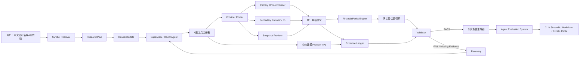

# FinTrace-CN：A股可验证金融研究 Agent 一个月二次开发方案（v2.0 严格执行版）

> 基于 `Agentic-Analyst/stock-analyst` 的二次开发规划
> 初版日期：2026-08-08
> 修订日期：2026-08-09
> 目标：在一个月内完成一个可运行、可验证、可评测、可复现、可演示、适合 Agent / LLM 应用开发实习投递的 A 股金融研究项目，而不是简单替换数据接口或修改项目名称。

### v2.0 本次评估后的关键修订

本版在原方案基础上增加并明确以下内容，后续开发以本版为准：

1. **Agent Evaluation System 保留并升级为核心主线**：评测 Tool Routing、参数、执行恢复、数字正确性、证据覆盖、端到端成功率、成本与延迟，并加入 Baseline / Ablation / Regression。
2. **增加 Point-in-Time / Research As-Of**：防止未来信息泄漏，财报不仅记录报告期，还记录实际披露与可用时间。
3. **增加 FinancialPeriodEngine**：统一 FY / Q1 / H1 / 9M / TTM，明确 A 股累计财报转单季与 TTM 的规则。
4. **增加价格复权口径**：RAW / QFQ / HFQ 明确区分，市值与估值不得误用复权价格。
5. **修正北交所代码**：2026 年内部 Canonical Symbol 统一使用 `920xxx.BJ`；旧 `83/87/88` 等代码只作为历史 alias 映射。
6. **固定行业分类口径**：同行选择不能让 LLM 自由判断，MVP 使用一个确定性行业体系并记录 standard / level / code。
7. **增加 ResearchPlan + ResearchState**：让 Agent 的 Planning、Tool Use、Recovery、Validation 可观察、可评测。
8. **增加 Typed Provider Errors**：区分限流、超时、鉴权、权限、Schema 变化、空数据、代码不存在等错误，决定 retry / fallback / fail-fast。
9. **MVP 再收缩**：一个月优先完成一个在线 Provider + Snapshot；第二在线 Provider、完整公告源和 UI 美化降为 P1，避免数据适配拖死主线。
10. **增加 Definition of Done 与停止线**：宁可砍 UI、新闻、多 Agent，也不砍 Validator、Evidence、Agent Eval 和可复现性。

---

## 1. 最终开发方向

项目建议正式定位为：

**FinTrace-CN —— 面向 A 股的可验证金融研究 Agent。系统通过国产大模型进行任务理解和工具编排，通过确定性 Python 引擎完成财务指标、同行估值和风险校验，并为关键数字保留数据来源、报告期、单位、获取时间和计算过程。**

一句话卖点：

> 不让大模型“猜”估值，而是让 Agent 找数据、Python 算结果、Validator 查错误、Evidence Ledger 证明答案从哪里来。

项目的核心不是“把 yfinance 换成 AKShare”，而是完成以下四层改造：

1. **A 股原生化**：支持中文公司名、沪深京代码、人民币、A 股财报口径、交易状态、公告来源与本土行业规则。
2. **可验证化**：关键数字可追溯，估值由 Python 确定性计算，报告结论能回指原始数据和公式。
3. **可评测化**：建立独立 Agent Evaluation System，评测工具路由、参数、恢复、数字、证据、成本与端到端任务成功率。
4. **可复现化**：在线数据可保存为版本化快照，记录模型、Prompt、Git Commit、Research As-Of 和 Snapshot ID，离线可重复运行并做回归比较。

项目最终应形成四根柱子：

```text
FinTrace-CN
├── Agent System
│   ├── ResearchPlan
│   ├── Tool Calling
│   ├── Recovery
│   └── ResearchState
├── Data Infrastructure
│   ├── Provider Router
│   ├── Canonical Schema
│   ├── Snapshot
│   └── Point-in-Time
├── Financial Reliability
│   ├── Deterministic Valuation
│   ├── Evidence Ledger
│   └── Validator
└── Agent Evaluation System
    ├── Benchmark
    ├── Metrics
    ├── Regression
    └── Ablation
```

不建议把“预测涨跌”“量化交易”“自动选牛股”作为主线。这些功能很难在一个月内形成可信证据，容易在面试中被追问数据泄漏、回测偏差和收益承诺。项目应明确声明：**只做研究辅助，不构成投资建议，不接券商账户，不执行交易。**

---

## 2. 当前仓库真实状态与问题诊断

### 2.1 已经完成的能力

当前分支不是原始上游的空白版本，已经完成一轮二次开发：

- 当前仓库 `origin` 指向个人仓库 `FinTrace-CN`，`upstream` 指向原项目。
- 当前提交已有标签 `deepseek-integration-v1`。
- DeepSeek Flash 已成为默认模型，模型注册、OpenAI-Compatible 调用、成本统计和集成测试已经存在。
- `python main.py --list-llms` 与动态模型列表已经实现。
- 当前离线测试结果：**108 passed，3 skipped**。
- 现有主流程包括财务数据、财务模型、新闻分析、报告生成以及通用 ReAct 工具调用。
- 项目已有 Excel DCF 模型生成能力，这是可复用的差异化资产，不应推倒重写。

因此，参考 Word 中的八周路线时，应把“第四批 DeepSeek 接入”视为已经完成，而不是再次占用第一周。

### 2.2 截图报错的真实原因

截图中的核心异常是：

```text
yfinance.exceptions.YFRateLimitError: Too Many Requests. Rate limited.
curl https://query1.finance.yahoo.com/... -> Too Many Requests
```

这说明请求已经到达 Yahoo，但被限流。它不等于“只要设置代理就能修好”，原因可能同时包括：

- Yahoo 对 IP、Cookie、User-Agent 或请求频率进行限制；
- `yfinance` 多个工具分别请求价格、公司信息、新闻和财务报表，容易重复访问；
- 国内网络访问 Yahoo 不稳定；
- 重试机制如果没有全局限速和缓存，反而会加重限流。

结论：**代理只能作为可选网络配置，不能继续作为核心架构的前提。** A 股主路径中应彻底取消对 Yahoo 的强依赖。

### 2.3 当前代码中的关键耦合点

| 位置 | 当前行为 | A 股改造问题 |
|---|---|---|
| `main.py` | 初始化时直接通过 `yf.Ticker(...).info` 获取公司名 | 系统启动就可能因 Yahoo 失败，必须改为 Provider 查询 |
| `src/financial_scraper.py` | 财务三表直接绑定 `yfinance.Ticker` | 无法表达 A 股合并报表、报告期、币种和字段映射 |
| `src/agents/tools/data_tools.py` | 代码搜索、价格、技术指标、新闻主要依赖 yfinance | 中文公司名和 A 股代码体验差，且所有轻量工具都受 Yahoo 限流影响 |
| `src/agents/tools/capital_markets_tools.py` | 风险指标和组合数据依赖 yfinance | 计算逻辑可保留，数据读取层必须替换 |
| `src/article_scraper.py` | 依赖海外搜索与网页抓取 | 国内可用性、版权、反爬和证据稳定性不足 |
| `requirements.txt` | `vynn-core` 通过 GitHub URL 安装 | 国内首次安装仍可能卡在 GitHub，必须可选化或本地替代 |
| prompts | 以英文 ticker、美股和 Yahoo 语境为主 | 需要补充中文名称、A 股代码、财报口径和风险声明 |

### 2.4 当前工作区注意事项

当前已有未提交修改：`.env.example`、`main.py` 和 `src/agents/supervisor/supervisor.py`。后续开发前应先确认这些改动的用途并单独提交。`supervisor.py` 当前主要表现为换行符变化，导致 Git 显示近 1900 行修改及大量 trailing whitespace；建议先做一次换行符规范化提交，避免后续真实 diff 被噪声淹没。

---

## 3. 一个月 MVP 的范围

### 3.1 必须完成（P0）

P0 是“没有它就不算完成该项目”的最小闭环。一个月内优先保证深度、正确性和可复现性，不追求功能数量。

1. 支持中文公司名与 `600519.SH / 000333.SZ / 300750.SZ / 920xxx.BJ` 等 Canonical Symbol。
2. 建立统一 `FinancialDataProvider`，A 股业务代码不再直接 import yfinance。
3. 实现 `SnapshotProvider`，默认测试完全离线、无 API 费用、无 Yahoo、无代理仍可运行。
4. 实现**至少一个稳定的国内在线 Provider**；第二在线 Provider 不作为 P0 阻塞项。
5. 支持公司资料、日线行情、三张财务报表和核心财务指标；公告权威源若本月来不及可降为 P1。
6. 实现 `Research As-Of / Point-in-Time`：所有研究任务有明确时点，禁止使用当时尚未公开的数据。
7. 实现 `FinancialPeriodEngine`：统一 FY / Q1 / H1 / 9M / TTM，保证同行估值使用一致期间口径。
8. 实现 PE、PB、PS 三类同行估值的确定性计算；EV/EBITDA 作为 P1，除非第 2 周进度提前。
9. 实现 Evidence Ledger：每个关键数值记录来源、日期、报告期、单位、字段路径、披露时间和计算 ID。
10. 实现 Validator：重算估值公式，检查单位、币种、报告期、TTM、复权口径、缺失值、异常值和无来源数字。
11. 实现 `ResearchPlan + ResearchState`，记录任务拆解、工具轨迹、缺失证据、冲突、恢复路径和最终校验结果。
12. 建立 **Agent Evaluation System**：至少 20 个离线案例，包含工具、参数、恢复、数字、证据、成本/延迟和 E2E 任务成功率。
13. 至少完成 **1 份可完全重算的贵州茅台研究报告**，并可从固定 Snapshot 重新生成。
14. 提供 CLI 或最小可演示界面；完整 Streamlit 工作台不阻塞 P0。

### 3.2 应该完成（P1）

- 第二在线 Provider，并实现主源 -> 备用源 -> Snapshot 的降级路径；
- 权威公告证据检索：巨潮资讯 / 交易所披露；
- EV/EBITDA 与现有 DCF 的交叉验证；
- A 股交易状态：ST、停牌、涨跌停状态、上市时间不足等提示；
- 对银行、保险等行业启用“估值能力矩阵”，自动禁用不合适的通用 DCF 或 EV/EBITDA；
- 第二份样例报告：招商银行，用于证明系统知道“哪些模型不该使用”；
- 报告导出 Markdown、JSON 和 Excel；
- Streamlit 研究工作台；
- Docker 或本地一键启动脚本、健康检查和结构化日志。

### 3.3 有余力再做（P2）

- 50 题完整评测和 HTML 对比报告；
- 行业景气指标、机构调研、资金面扩展；
- PDF 年报原文段落级检索；
- 多模型对比；
- 新闻搜索扩展；
- 更精致的可视化和 PDF 导出；
- LangGraph 重构或多 Agent 并行。

### 3.4 一个月内明确不做

- 全 A 股全字段覆盖；
- 自动交易、回测策略和收益率承诺；
- 实时 Tick/分钟级行情；
- 银行、保险、券商、REITs 全部专用估值模型；
- 复杂 RAG 平台、向量数据库集群和大规模 Multi-Agent；
- 手机 App、小程序和多租户商业系统；
- 为“技术栈关键词”强行重写稳定模块。

### 3.5 一个月内的取舍原则

```text
正确性 / 可验证 / 可评测 / 可复现
    > UI 美化
    > 数据源数量
    > 新闻扩展
    > Multi-Agent
    > 技术栈炫技
```

若进度落后，优先砍 Streamlit、美化、新闻、多模型和第二 Provider，不砍 Snapshot、Validator、Evidence Ledger、Agent Eval 和固定样例。

---

## 4. 数据源选型

### 4.1 推荐组合

| 层级 | 推荐方案 | 用途 | 原因与限制 |
|---|---|---|---|
| 默认测试 | 本地 JSON/Parquet Snapshot | 所有测试、演示兜底、版本对比 | 最稳定、可复现、无网络成本 |
| 标准化主源 | Tushare Pro | 股票列表、交易日历、日线、三表、财务指标 | 字段较标准，但部分接口有积分和频率门槛 |
| 无 Key 备用源 | AKShare | 行情、财务指标、基础资料的补充 | 免费且国内友好，但许多接口是对公开网页的封装，字段与上游页面可能变化 |
| 权威证据源 | 巨潮资讯 / 上交所 / 深交所 / 北交所 | 年报、季报和临时公告 | 适合做最高等级的原始披露证据，不应把网页抓取结果直接当结构化财务真值 |
| 美股兼容 | yfinance（降级为可选） | 保留原项目能力 | 不再进入 A 股默认路径，失败时不影响系统启动 |

推荐运行策略：

```text
开发和 CI：SnapshotProvider
有 Tushare Token：TushareProvider -> AKShareProvider -> SnapshotProvider
无 Token 演示：AKShareProvider -> SnapshotProvider
原始披露核验：CninfoEvidenceProvider
```

**Point-in-Time 规则**：在线 Provider 读取数据时必须尽可能保留 `published_at / available_at`。研究时点 `research_as_of` 早于数据公开时间时，该数据不得进入本次研究事实集；抓取时间 `fetched_at` 不能替代披露时间。

不建议仅使用 AKShare 作为唯一真值源，因为 AKShare 文档显示部分行情接口实际来自东方财富等网页，接口稳定性仍受第三方页面影响。Tushare 官方文档提供 A 股日线、三表和财务指标，但部分接口明确存在积分门槛。因此二者应通过统一接口组合，而不是散落在 Agent 工具里。

官方参考：

- [Tushare 股票数据与财务数据目录](https://tushare.pro/document/2?doc_id=17)
- [Tushare 每日指标接口及积分说明](https://tushare.pro/document/2?doc_id=32)
- [AKShare A股股票数据文档](https://akshare.akfamily.xyz/data/stock/stock.html)
- [巨潮资讯网](https://www.cninfo.com.cn/)

### 4.2 数据可信度等级

建议为证据增加 `source_tier`：

| 等级 | 来源 | 使用规则 |
|---|---|---|
| A | 交易所、巨潮资讯、上市公司正式公告 | 可支撑财报事实和重大事件 |
| B | Tushare 等结构化数据服务 | 可用于批量计算，报告中保留 provider 和日期 |
| C | AKShare 封装的公开行情/财经站点 | 可用于行情和交叉验证，出现冲突时不覆盖 A 级来源 |
| D | 普通新闻和搜索结果 | 只用于背景、风险和催化剂，不直接作为估值基础真值 |

当两个来源冲突时，不要静默覆盖，应输出 `data_conflicts`，记录两个值、来源、报告期和选择理由。

---

## 5. 目标架构



关键边界：

- **LLM / Agent**：识别意图、生成 ResearchPlan、选择工具、处理缺失证据、解释结果、组织报告。
- **ResearchState**：保存 query、research_as_of、symbol、plan、facts、calculations、missing_evidence、conflicts、validation_result、tool_trace 和 report。
- **Provider**：获取和规范化数据，不做投资结论。
- **FinancialPeriodEngine**：处理 FY / Q1 / H1 / 9M / TTM 与累计口径，不调用 LLM。
- **Valuation Engine**：纯 Python 计算，不调用 LLM。
- **Validator**：纯 Python 重算和检查，结果不可被 LLM 修改或绕过。
- **Evidence Ledger**：保存事实、计算、来源与时点；报告只能引用已登记 ID。
- **Report Generator**：只能引用已存在的事实 ID 和计算 ID，不允许生成无来源数字。
- **Agent Evaluation System**：独立运行在固定 Snapshot / Benchmark 上，不能用“看起来合理”代替可计算指标。

设计哲学：

> **LLM 负责“研究什么、调用什么、怎么解释”；Python 负责“数字是多少”；Evidence 负责“数字从哪来”；Validator 负责“数字能不能信”；Eval 负责“系统是否真的变好了”。**

---

## 6. 建议的代码结构与修改清单

```text
src/
  domain/
    symbols.py                 # 中文名、代码、交易所标准化
    models.py                  # CompanyProfile / MarketBar / FinancialStatement
    evidence.py                # EvidenceItem / EvidenceLedger / DataConflict
    research.py                # ResearchPlan / ResearchState
    errors.py                  # Typed Provider / Validation errors
  providers/
    base.py                    # FinancialDataProvider Protocol
    router.py                  # 主源、备用源、缓存、降级、熔断
    tushare_provider.py
    akshare_provider.py
    snapshot_provider.py
    cninfo_evidence_provider.py
    field_mapping_cn.py        # A股字段映射和单位换算
  financial_periods/
    engine.py                  # FY/Q1/H1/9M/TTM
    policies.py                # 累计值、单季值、修订记录规则
  valuation/
    peer_selector.py
    multiples.py
    dcf_bridge.py
    industry_policy.py         # 行业适用估值方法矩阵
  validation/
    financial_validator.py
    report_validator.py
  evaluation/
    datasets/
      routing_cases.json
      parameter_cases.json
      finance_cases.json
      evidence_cases.json
      failure_cases.json
    evaluators/
      tool_evaluator.py
      parameter_evaluator.py
      numerical_evaluator.py
      evidence_evaluator.py
      recovery_evaluator.py
      safety_evaluator.py
    runner.py
    metrics.py
    schemas.py
    report.py
  agents/tools/
    cn_market_tools.py
    evidence_tools.py
  ui/
    app.py
snapshots/
  CN/600519.SH/<snapshot_id>/
tests/
  unit/
  contract/
  integration/
  golden/
  e2e/
```

现有文件的改造顺序：

1. `main.py`：删除初始化阶段对 `yf.Ticker(...).info` 的直接调用，改用 `provider.search_company()`。
2. `src/financial_scraper.py`：保留公开类接口，内部改成 Provider 适配器，避免一次性破坏上层 Agent。
3. `src/agents/tools/data_tools.py`：保留美股工具；新增 A 股工具，不要在同一个函数内堆大量 `if market == ...`。
4. `src/agents/tools/capital_markets_tools.py`：把“取历史价格”和“计算风险指标”拆开，计算器只接受标准 DataFrame。
5. `src/agents/generalist_agent.py`：把“中文名先翻译成英文再搜 Yahoo”的提示替换为本地证券主数据解析。
6. `src/article_scraper.py`：A 股默认检索公告，普通网页新闻降为 P2。
7. `requirements.txt`：加入锁定版本的 A 股依赖；将 `vynn-core` 和海外新闻依赖改为可选 extra，保证基础安装不访问 GitHub。
8. `prompts/`：新增 A 股研究规则、证据引用规则和行业估值适用性规则。

### 6.1 统一 Provider 接口

```python
class FinancialDataProvider(Protocol):
    name: str

    def search_company(self, query: str) -> list[CompanyProfile]: ...
    def get_company_profile(self, symbol: str) -> CompanyProfile: ...
    def get_daily_bars(self, symbol: str, start: date, end: date) -> list[MarketBar]: ...
    def get_financial_statements(self, symbol: str, periods: int = 8) -> FinancialBundle: ...
    def get_financial_indicators(self, symbol: str, periods: int = 8) -> list[FinancialIndicator]: ...
    def get_peer_candidates(self, symbol: str) -> list[CompanyProfile]: ...
```

Provider 返回对象必须携带：

```text
symbol, market, exchange, currency
research_as_of, as_of_date, fiscal_period, period_type, consolidation_scope
published_at, available_at, revision_id, is_restated
value, unit, scale
provider, source_url, fetched_at, source_tier
is_missing, missing_reason, raw_field
```

硬规则：缺失值使用 `None`，绝不自动补 `0`；金额在进入估值引擎前统一到“元”；比率明确存储为小数还是百分数；报告期不得用抓取日期代替；`fetched_at` 不得冒充 `published_at`；研究时点早于 `available_at` 的数据不得进入本次事实集。

### 6.2 A 股代码标准化

内部统一采用：

- `600519.SH`：上海主板；
- `000333.SZ`、`300750.SZ`：深圳主板 / 创业板；
- `688981.SH`：科创板；
- `920xxx.BJ`：北交所当前统一代码体系。

输入层接受 `600519`、`SH600519`、`600519.SH`、`贵州茅台`，但进入 Provider 前必须转换为 Canonical Symbol。公司搜索结果包含匹配方式与置信度；多家公司重名或置信度低时让用户确认，不能让 LLM 猜代码。

北交所旧 `83xxxx / 87xxxx / 88xxxx` 等代码仅作为 `LegacySymbolAlias` 支持，通过新旧代码映射转换为 `920xxx.BJ`，不得继续作为 2026 年系统内部 canonical。北交所已自 2025-10-09 起为存量上市公司启用新证券代码，项目实现时应保留官方映射来源与映射版本。

### 6.3 离线快照格式

```json
{
  "schema_version": "1.0.0",
  "snapshot_id": "600519.SH_20260808_v1",
  "provider": "tushare",
  "symbol": "600519.SH",
  "research_as_of": "2026-08-08T10:00:00+08:00",
  "fetched_at": "2026-08-08T10:00:00+08:00",
  "mapping_version": "cn-fields-1.0.0",
  "payload_sha256": "...",
  "source_urls": [],
  "data": {}
}
```

快照不能只保存最终报告，必须保存 Provider 规范化后的数据和原始字段映射。评测记录同时保存 `git_commit`、模型名、Prompt 版本、`research_as_of` 和 Snapshot ID。

### 6.4 Research As-Of 与 Point-in-Time

每次研究必须显式拥有：

```text
research_as_of = 用户指定时间，默认当前时间
```

任何事实进入 ResearchState 前必须满足：

```text
available_at <= research_as_of
```

财务数据至少区分：

- `fiscal_period`：数据属于哪个财务期间；
- `published_at`：上市公司 / 交易所何时披露；
- `available_at`：系统在何时可合法视为“已经知道”；
- `fetched_at`：本系统何时抓到该数据；
- `revision_id / is_restated`：是否为后续修订版本。

禁止使用研究时点之后才公开的数据，避免 future information leakage / look-ahead bias。即使本项目不做回测，这一规则也用于保证历史研究可复现。若某 Provider 无法提供可信的 `published_at / available_at`，则该字段可用于“当前时点研究”但必须带 warning；**不得用于历史 as-of 研究的关键事实真值**。

### 6.5 FinancialPeriodEngine：FY / 单季 / TTM

A 股利润表和现金流量表大量字段为“年初至报告期累计值”，不能把 H1 或 9M 直接当成独立单季值。

MVP 明确定义：

```text
Q2 单季 = H1累计 - Q1累计
Q3 单季 = 9M累计 - H1累计
Q4 单季 = FY累计 - 9M累计
TTM = 当期累计 + 上一FY - 上年同期累计
```

所有公式需要针对字段属性区分：

- **流量类**：营业收入、净利润、经营现金流等，可按累计规则转换；
- **存量类**：资产、负债、现金、股东权益等使用期末值，不能做累计差分。

任何估值结果必须记录使用的 `period_basis`，例如 `2026Q2_TTM`，同行不得混用 FY、TTM 和单季口径。

### 6.6 价格与复权口径

`MarketBar` 至少包含：

```text
trade_date
open / high / low / close
volume / amount
adjustment = RAW | QFQ | HFQ
adj_factor
trading_status
```

硬规则：

- 当前市值、PE/PB/PS 等估值基础使用**未复权现价（RAW）**；
- 收益率、走势图等需要连续价格序列时可使用 QFQ/HFQ，但必须显式记录；
- 不允许用前复权价格直接乘当前总股本计算当前市值。

### 6.7 行业分类与同行选择口径

同行选择不得让 LLM 自由判断。`CompanyProfile` 增加：

```text
industry_standard
industry_level
industry_code
industry_name
```

MVP 只固定一种行业分类体系，并在快照中保存分类版本。`peer_selector.py` 只根据确定性规则筛选，LLM 只能解释同行入选 / 剔除理由，不能修改最终样本。

### 6.8 Typed Provider Errors 与 Router 行为

统一错误层级：

```text
ProviderError
├── RateLimitError
├── TimeoutError
├── AuthenticationError
├── PermissionError
├── SchemaChangedError
├── EmptyDataError
├── UnsupportedSymbolError
└── DataConflictError
```

Router 行为必须确定：

| 错误 | 行为 |
|---|---|
| RateLimit | 短暂 cooldown；有限重试；切换 fallback |
| Timeout | 有限重试；切换 fallback |
| Authentication / Permission | 不盲目重试；切换可用 Provider 或清晰失败 |
| SchemaChanged | 不重复请求；记录 warning；切换 fallback |
| EmptyData | 先判断停牌 / 未上市 / 数据缺失，再决定 fallback |
| UnsupportedSymbol | 不轮询所有 Provider；返回代码解析层 |
| DataConflict | 不静默覆盖；写入 Evidence Ledger / `data_conflicts` |

禁止使用 `except Exception: fallback()` 作为最终实现。

### 6.9 Cache、Rate Limit 与 Snapshot 的边界

`Cache` 与 `Snapshot` 不是一回事：

- **Cache**：为了减少重复在线请求、控制成本与限流，可过期；
- **Snapshot**：为了评测与复现，内容版本化，不随 TTL 自动变化。

建议缓存键至少包含：

```text
provider + endpoint + symbol + date_range + period + adjustment + schema_version
```

不同数据采用不同 TTL；财报、公司资料和交易日历不应与实时行情使用同一个 TTL。Provider Router 需要记录 `cache_hit`，Agent Eval 统计缓存命中率，但 benchmark 默认读取固定 Snapshot，避免缓存状态影响评测。

所有在线 Provider 设置最大并发、最大重试次数和退避策略；同一请求在一次 ResearchState 中不得被无意义重复拉取。

---

## 7. 最值得开发的功能

### 7.1 Evidence Ledger（项目第一亮点）

每个事实生成唯一 ID，例如：

```text
fact_600519_revenue_2025FY
calc_600519_pe_median
doc_600519_2025_annual_report_p137
```

报告中的关键数字必须引用这些 ID。报告完成后运行 `ReportValidator`：

- 抽取报告中的金额、百分比、倍数和每股价值；
- 检查是否能匹配某个 fact 或 calc；
- 检查引用来源是否支持该字段；
- 输出 `unsupported_numbers` 和 `citation_coverage_rate`。

这一功能比“又接了一个大模型”更容易形成面试差异化。

### 7.2 确定性同行估值（项目第二亮点）

支持：PE、PB、PS、EV/EBITDA。

流程固定为：

1. Provider 生成同行候选；
2. Python 根据行业、规模、盈利状态、报告期和字段完整度打分；
3. 保留 5 至 10 家同行并记录入选/剔除原因；
4. 检查倍数适用条件；
5. 同行不少于 5 家时使用 IQR 识别异常值；
6. 输出 P25、中位数、P75 与隐含每股价值；
7. 保留异常值处理前后数据。

行业规则示例：

- 银行：第一版以 PB、PE、ROE 为主，禁用 EV/EBITDA；
- 保险：优先 PB/PE，并提示通用 DCF 置信度低；
- 亏损科技公司：禁用 PE；
- EBITDA 为负：禁用 EV/EBITDA；
- 净资产为负：禁用 PB；
- 周期行业：提示单期利润可能导致 PE 失真。

### 7.3 Validator（项目第三亮点）

Validator 至少检查：

- 市值 = 股价 × 总股本；
- EV 到 Equity Value 桥接；
- 隐含每股价值 = 隐含股权价值 / 稀释后股本；
- 同一计算是否混入“万元、亿元、元”；
- 人民币与美元是否被直接相加；
- 年报、季报和 TTM 是否混用；
- 负分母是否错误进入倍数中位数；
- 选中同行是否少于 4 家；
- 数据是否过期；
- 报告数字是否等于计算结果。

输出固定结构：

```json
{
  "valid": false,
  "errors": [],
  "warnings": [],
  "recalculated_values": {},
  "evidence_coverage": 0.0
}
```

### 7.4 A 股特有风险提示

建议新增 `get_cn_market_risks`：

- 是否 ST / *ST；
- 是否停牌；
- 是否触及涨跌停；
- 上市未满一年；
- 最近是否有业绩预告、监管问询、减持、质押、重大诉讼或审计意见异常；
- 财报是否超过允许的新鲜度阈值。

该工具输出客观标志和证据，不输出“买入/卖出”。

### 7.5 ResearchPlan + ResearchState（Agent 主体能力）

Agent 不能只表现为“LLM 调几个 Tool”。每个请求先生成结构化 `ResearchPlan`，例如：

```json
{
  "intent": "valuation_research",
  "symbol": "600519.SH",
  "research_as_of": "2026-08-09T12:00:00+08:00",
  "tasks": [
    "company_profile",
    "latest_price",
    "financials",
    "peer_selection",
    "peer_valuation",
    "validation"
  ],
  "required_evidence": [
    "price",
    "shares",
    "net_profit_ttm",
    "peer_multiples"
  ]
}
```

建议 `ResearchState`：

```text
trace_id
query
research_as_of
symbol
plan
facts
calculations
missing_evidence
conflicts
validation_result
tool_trace
cost_trace
report
```

执行逻辑：

```text
Resolve Symbol
  -> Plan
  -> Execute Tools
  -> Compute
  -> Validate
      -> PASS -> Report
      -> FAIL / Missing Evidence -> Recovery -> Execute Tools
```

Recovery 必须有停止条件，禁止 Agent 因失败无限重复 Tool Call。每次研究生成唯一 `trace_id`，每个 Tool Call 记录 `tool_name / arguments / started_at / ended_at / result_status / provider / retry_count / evidence_ids`，供调试和 Agent Eval 使用。MVP 可继续使用现有 ReAct / Supervisor，不要求为了 LangGraph 关键词重写；若后续迁移 LangGraph，ResearchState 可直接作为图状态基础。

### 7.6 研究工作台

若 P0 提前完成，P1 使用 Streamlit 快速实现，不做完整前后端分离。页面包括：

- 研究页：中文公司搜索、问题、模型、Provider、在线/离线模式；
- 过程页：Agent 当前步骤、工具参数、降级路径、Trace ID；
- 财务页：三表摘要、趋势、单位和报告期；
- 估值页：同行列表、倍数分布、P25/Median/P75、DCF 对比；
- 证据页：事实 ID、来源等级、公告链接、冲突和缺失值；
- 校验页：errors、warnings、重算值和引用覆盖率；
- 评测页：工具选择、数字一致性、成功率、延迟和成本。

---

## 8. 首批样例公司

为了一个月内兼顾行业差异与数据完整度，建议先做 8 家，不强求 Word 中的 10 家：

| 公司 | 代码 | 行业 | 主要验证点 |
|---|---|---|---|
| 贵州茅台 | 600519.SH | 白酒 | 高利润消费、PE/PS、公告证据 |
| 五粮液 | 000858.SZ | 白酒 | 茅台同行比较 |
| 美的集团 | 000333.SZ | 家电 | 制造业现金流、PE/EV-EBITDA |
| 比亚迪 | 002594.SZ | 汽车 | 高增长、资本开支、同行筛选 |
| 宁德时代 | 300750.SZ | 新能源 | 创业板、成长估值 |
| 恒瑞医药 | 600276.SH | 医药 | 研发投入、利润与估值口径 |
| 中国平安 | 601318.SH | 保险 | 行业估值能力矩阵 |
| 招商银行 | 600036.SH | 银行 | PB/ROE，验证通用模型禁用机制 |

MVP 样例报告优先选择：

- **贵州茅台**：展示普通非金融公司完整流程；
- **招商银行**：展示系统知道“哪些模型不该使用”，体现专业边界。

北交所支持先完成 `920xxx.BJ` 代码解析、旧代码 alias 映射和行情契约，不必在首月完成完整估值样例。

---

## 9. 四周执行计划

### 第 1 周：证明“数据正确”——解除 Yahoo 强耦合，建立可复现 A 股数据层

目标：输入“分析贵州茅台”后，在不访问 Yahoo 的情况下完成公司解析、价格、财务数据读取；断网可从 Snapshot 完成同一条链路。

任务：

- 整理并提交当前工作区修改，消除 `supervisor.py` 换行符噪声；
- 新建 domain models、Symbol Resolver、Provider Protocol；
- 修正北交所 canonical 为 `920xxx.BJ`，实现旧代码 alias；
- 对 Tushare 与 AKShare 各做一个小型 spike，**只选一个作为本周正式在线 Provider**；
- 实现 SnapshotProvider、最小 Cache / Rate Limit 机制与 Provider Contract Test；
- 实现公司搜索、日线行情、三表、核心指标接口；
- 增加 `research_as_of / published_at / available_at / revision_id`；
- 实现 FinancialPeriodEngine 的最小版：FY/Q1/H1/9M/TTM；
- 明确 RAW/QFQ/HFQ；
- 改造 `main.py` 与 `FinancialScraper`，启动阶段不访问 yfinance；
- 将 `vynn-core`、海外新闻和 yfinance 变为可选依赖；
- 保存至少 5 家样例公司的首版规范化快照；
- 写字段映射、Period、Point-in-Time 和价格口径测试。

验收：

- 断网运行 `SnapshotProvider` 成功；
- 中文名、裸代码、带后缀代码、北交所新旧代码解析正确；
- A 股默认路径不依赖 yfinance；
- 同一快照输入可重复得到相同规范化数据；
- `research_as_of` 早于披露日时，未来财报不会进入事实集；
- TTM golden test 正确；
- 原 108 个离线测试不回归。

建议标签：`cn-data-pit-v1`。

### 第 2 周：证明“数字正确”——确定性同行估值 + Validator

目标：为贵州茅台生成可重算的 PE/PB/PS 同行估值区间。

任务：

- 固定一种行业分类体系并保存版本；
- 实现候选公司、确定性筛选和理由记录；
- 实现 PE/PB/PS；若进度提前再做 EV/EBITDA；
- 实现 IQR 异常值识别；
- 实现行业适用性矩阵；
- 实现单位、币种、报告期、TTM、复权和公式 Validator；
- 把结果写入现有 Excel，采用新增工作表，保留原 DCF 工作表；
- 编写 golden tests，固定输入必须产生固定输出。

验收：

- 每个估值数字能由测试独立重算；
- 负 PE 不进入中位数；
- 人为修改单位、股本、报告期或公式时 Validator 必须失败；
- 少于 4 家同行时输出低置信度，不伪造结果；
- 使用复权价格计算当前市值时测试必须失败；
- 银行等行业自动禁用不适用倍数。

建议标签：`cn-valuation-validator-v1`。

### 第 3 周：证明“Agent 真的有用”——Evidence + Planning + Agent Eval

目标：Agent 能形成 ResearchPlan、调用 A 股工具、失败恢复并输出有证据覆盖率的研究报告；评测系统能证明版本差异。

任务：

- 实现 Evidence Ledger；
- 实现 `ResearchPlan + ResearchState`；
- 新增 `resolve_cn_symbol`、`get_cn_prices`、`get_cn_financials`、`value_with_peers`、`validate_research`；公告工具根据进度决定 P0/P1；
- 增加 Typed Provider Errors、retry / fallback / fail-fast；
- 改造中文 Agent Prompt 和错误恢复；
- 报告只允许引用事实 ID 与计算 ID；
- 建立至少 20 题离线 Agent Benchmark，并固定 model / temperature / max_steps / snapshot / prompt 版本；
- 建立 Direct LLM / Agent+Tools / Agent+Evidence / Agent+Evidence+Validator 的 Baseline / Ablation；
- 输出 JSON/CSV 评测结果和失败详情；
- 加入 Regression：新提交不得让核心 golden/eval 指标无解释下降。

20 题最低分布：

| 类型 | 数量 |
|---|---:|
| 中文名/代码解析 | 3 |
| Tool Routing | 3 |
| 参数与报告期 | 3 |
| 财务数字/同行估值 | 4 |
| 引用和证据 | 3 |
| Provider 异常恢复 | 3 |
| 安全/拒绝收益承诺 | 1 |

验收：

- Tool F1 达到预设基线并记录真实结果；
- 必填参数正确率达到预设基线并记录真实结果；
- golden 数字一致率 = 100%；
- 关键数字引用覆盖率目标 ≥ 95%，若未达到必须保留失败案例；
- Provider 故障案例能正确 fallback 或清晰 fail-fast；
- Recovery 不出现无限 Tool Call；
- 默认 `pytest` 和 benchmark 不发起真实网络请求；
- 至少形成一张 Ablation 对比表。

建议标签：`cn-agent-eval-v1`。

### 第 4 周：证明“别人能看懂、能复现、能面试讲”——样例、部署与求职包装

目标：形成可在 3 分钟内演示、10 分钟内让他人跑起离线版本的完整项目。

任务：

- 生成贵州茅台完整样例报告；
- 若进度允许，生成招商银行边界案例；
- 完成 Excel 估值与 Validation 工作表；
- 若 P0 已稳定，再实现 Streamlit 工作台；否则保留 CLI / Markdown Demo；
- 增加 Docker/本地一键启动、health check 和 `.env.example`；
- 完善 README、架构图、数据源、估值方法、Point-in-Time、Agent Eval、局限性和许可证说明；
- 录制 3 分钟演示视频；
- 整理项目面试问题、失败案例与技术难点。

验收：

- 新用户按 README 在 10 分钟内运行离线 Demo；
- 无 Tushare Token、无 Yahoo、无代理时仍能运行快照演示；
- Demo 能展示 ResearchPlan、Tool Trace、Evidence、Validator、Eval 至少四类信息；
- 贵州茅台样例可从固定 Snapshot 重新生成；
- 评测报告包含版本、模型、Prompt、Snapshot、Git Commit；
- `git diff --check` 通过，测试报告和版本标签完整。

建议标签：`fintrace-cn-portfolio-v1.0`。

---

## 10. Agent 测试与评测系统

Agent Evaluation System 是本项目的核心主线，不是发布前附带跑几条测试。它回答：**Agent 到底有没有变好，以及好在哪里。**

### 10.1 测试分层

```text
tests/unit          纯计算、代码解析、字段映射、Period Engine；禁止网络
tests/contract      对所有 Provider 运行相同接口契约
tests/golden        固定快照、固定估值和固定 Validator 结果
tests/integration   手动启用真实在线 Provider / DeepSeek
tests/e2e           中文问题 -> Plan -> Tools -> 估值 -> Evidence -> Validator -> 报告
```

所有在线测试使用 `@pytest.mark.integration`，无 Key 时 skip；CI 默认只运行离线测试与固定 Benchmark。

### 10.2 评测数据集

```text
evaluation/datasets/
├── routing_cases.json
├── parameter_cases.json
├── finance_cases.json
├── evidence_cases.json
└── failure_cases.json
```

每个案例至少包含：

```text
case_id
query
research_as_of
snapshot_id
expected_symbol
expected_tools / forbidden_tools
expected_parameters
expected_facts / calculations
expected_failure_behavior
```

### 10.3 七层 Agent Eval

#### A. Tool Routing

评测 Agent 是否选对工具、是否调用不必要工具。

指标：

- Tool Precision
- Tool Recall
- Tool F1
- 调用顺序正确率
- Unnecessary Tool Call Rate

#### B. Parameter Accuracy

评测 Tool 选对但参数填错的问题：

- symbol 正确率；
- 日期 / `research_as_of` 正确率；
- fiscal period / TTM 参数正确率；
- Schema 合法率；
- 必填参数完整率。

#### C. Execution / Recovery

主动注入：限流、超时、空表、权限不足、字段改名等故障。

指标：

- Recovery Success Rate
- Fallback Success Rate
- Average Retry Count
- Unnecessary Retry Rate
- Infinite Loop Count（必须为 0）

#### D. Financial / Numerical Correctness

数字评测必须由 Python 确定性判断，不能交给 LLM Judge。

指标：

- Exact Match
- Tolerance Match
- Formula Recalculation Pass Rate
- Validator Pass Rate
- Period Consistency Rate

#### E. Evidence Quality

评测报告里的数字是否可追溯：

- Citation Coverage Rate
- Unsupported Number Rate
- Source Tier Distribution
- Evidence-to-Claim Match Rate
- Data Conflict Resolution Accuracy

#### F. End-to-End Task Success

一条研究任务只有在以下条件满足时才算成功：

```text
证券解析正确
AND Tool 路径合理
AND 参数正确
AND 财务数字正确
AND 估值公式正确
AND 关键数字有证据
AND Validator 不存在阻断错误
AND 报告确实回答用户问题
```

可定义 `Task Success = 0/1`，并输出失败原因，不只输出一个总分。

#### G. Cost / Latency / Efficiency

每次运行记录：

```text
LLM calls
Tool calls
Input / Output tokens
Cost
Latency
Retries
Fallbacks
Cache hits
```

用于比较 Prompt、Planner 和恢复策略是否真正降低成本，而不是凭感觉优化。

### 10.4 Baseline 与 Ablation

固定同一套 Snapshot / Benchmark，至少比较：

```text
Baseline A: Direct DeepSeek
Baseline B: Agent + Tools
Version C: Agent + Tools + Evidence
Version D: Agent + Tools + Evidence + Validator
```

结果表中至少展示：

| Version | Tool F1 | 数字正确率 | 引用覆盖率 | Task Success | Avg Tool Calls | Avg Cost |
|---|---:|---:|---:|---:|---:|---:|
| Direct LLM | 实测 | 实测 | 实测 | 实测 | 实测 | 实测 |
| Agent + Tools | 实测 | 实测 | 实测 | 实测 | 实测 | 实测 |
| + Evidence | 实测 | 实测 | 实测 | 实测 | 实测 | 实测 |
| + Validator | 实测 | 实测 | 实测 | 实测 | 实测 | 实测 |

**所有数字必须真实跑出后再填，严禁预先编造。**

### 10.5 Regression Evaluation

每次关键架构 / Prompt 修改记录：

```text
git_commit
model
model_version
prompt_version
schema_version
mapping_version
snapshot_id
benchmark_version
```

若核心指标下降，必须输出失败案例 diff；不能只看平均分掩盖严重回归。

### 10.6 必测失败与安全场景

- Provider 超时、限流、返回空表和字段改名；
- 股票代码不存在、退市、停牌或名称歧义；
- 同一个报告期多条修订记录；
- 研究时点早于财报公开日；
- 财报单位为元 / 万元 / 亿元混用；
- TTM 计算所需期间缺失；
- 缺少 EBITDA、总股本或现金；
- 同行全部亏损；
- 报告数字被人工篡改；
- 新闻 / 公告正文中含 prompt injection；
- LLM 要求绕过 Validator；
- 快照 schema 版本不兼容；
- Agent 在 Tool 失败后重复调用超过最大次数。

安全原则：外部网页 / 公告正文一律视为**不可信数据**，其内容不能覆盖 system / developer 指令，不能直接修改工具白名单、Validator 规则或 Provider 配置。

### 10.7 LLM Judge 的边界

LLM Judge 仅用于语言层指标，例如：

- 是否回答了用户问题；
- 是否结构清晰；
- 是否解释充分。

LLM Judge **不得**决定：

- 股价 / 财务数值是否正确；
- 估值公式是否正确；
- 引用是否真的支持数字；
- `research_as_of` 是否发生未来信息泄漏。

这些必须由固定数据、规则和 Python 校验。

### 10.8 Agent 非确定性与评测稳定性

Agent / LLM 输出存在随机性，不能把一次运行结果当作绝对结论。评测环境固定：

```text
model / model_version
temperature（优先 0 或最低稳定值）
max_tokens
max_agent_steps
max_tool_calls
prompt_version
snapshot_id
benchmark_version
```

对关键 Routing / Recovery 案例，若模型仍存在明显随机性，可重复运行 3 次并记录 `pass@1 / success_rate / variance`。Golden 数字计算仍必须 100% 确定，不做概率判定。

---

## 11. Git 与开源归属

建议提交粒度：

```text
chore(repo): normalize line endings and preserve batch-4 baseline
feat(domain): add canonical A-share symbols, PIT and financial schemas
feat(period): add FY/Q1/H1/9M/TTM period engine
feat(provider): add snapshot and primary CN provider
feat(provider): add AKShare fallback and circuit breaker
feat(valuation): add deterministic peer multiples
feat(validation): add formula and evidence validators
feat(agent): add ResearchPlan, ResearchState and A-share tools
feat(eval): add 20-case offline benchmark and ablation
feat(ui): add research workbench
docs: publish architecture, methodology and limitations
```

每次提交前运行：

```powershell
python -m pytest -q -p no:cacheprovider
git diff --check
git status --short
```

许可证注意事项：

- 保留你所基于版本的原始许可证、版权声明和 `THIRD_PARTY_NOTICES.md`；
- README 明确写出“基于 Agentic-Analyst/stock-analyst 的二次开发”和具体基线 commit；
- 当前上游后续提交出现过许可证变化，不要在未核对许可证的情况下直接合并最新 upstream；
- 对 Tushare、AKShare、巨潮资讯及新闻内容分别说明使用方式、数据权利和限制；
- 不要把 API Key、付费数据快照或完整受版权保护年报文本提交到公开仓库。

---

## 12. 简历与面试包装

### 12.1 项目名称

**FinTrace-CN：面向 A 股的可验证金融研究 Agent**

### 12.2 简历描述参考（最终只保留真实完成项）

以下是目标版本模板。若第二 Provider、交易所公告、EV/EBITDA、DCF 等未在一个月内完成，必须从简历中删除对应表述。

> 基于开源金融研究 Agent 二次开发 A 股可验证研究系统，设计统一 FinancialDataProvider 与版本化 Snapshot Schema，接入 Tushare/AKShare/交易所公告并实现故障降级，使系统在无外网和无 API Key 环境下可离线复现。构建 Python 确定性同行估值与 Validator，支持 PE/PB/PS/EV-EBITDA、IQR 异常值处理、行业适用性校验和 DCF 交叉验证；搭建 20+ 固定案例评测，对工具路由、参数、数字一致性、引用覆盖、延迟和成本进行版本化评估。

只有在真实完成后才写入以下量化结果：测试数量、工具准确率、引用覆盖率、降级成功率和延迟改善；不要预先编造指标。

### 12.3 面试重点讲述

1. 为什么代理不是根本解决方案，以及如何通过 Provider 隔离网络不确定性；
2. 为什么 LLM 不负责金融计算；
3. 如何处理 A 股财报字段、单位、FY/Q1/H1/9M/TTM 与修订记录；
4. `research_as_of / available_at` 如何防止未来信息泄漏；
5. 为什么估值不能混用 RAW/QFQ/HFQ；
6. 如何证明报告里的数字没有幻觉；
7. 如何通过 Snapshot 让 Agent 评测可复现；
8. ResearchPlan / ResearchState 如何让 Agent 的 Planning 与 Recovery 可观察；
9. 如何设计 Agent Eval，而不是只看最终回答；
10. Evidence / Validator 的 Ablation 是否真的提高数字可靠性；
11. 为什么银行不能直接套制造业 EV/EBITDA；
12. Provider 字段变化、限流或权限错误时如何分类、重试和降级；
13. 如何在保留上游能力的同时控制二开范围。

### 12.4 最终作品集清单

- GitHub 仓库与清晰提交历史；
- 3 分钟演示视频；
- README 快速启动；
- 架构图和工具调用流程图；
- 贵州茅台研究报告；
- 招商银行研究报告（P1，若完成）；
- Excel 估值与 Validation 工作表；
- 20 题以上 Agent Benchmark 与 Ablation / Regression 评测报告；
- `ARCHITECTURE.md`、`DATA_SOURCES.md`、`VALUATION_METHODOLOGY.md`、`EVALUATION.md`、`LIMITATIONS.md`；
- 一页“失败案例与改进”说明，展示工程判断而不是只展示成功截图。

---

## 13. 开发优先级与停止线

如果时间不足，按以下顺序保留：

```text
Canonical Schema + Snapshot + Point-in-Time
  > FinancialPeriodEngine / TTM
  > 一个稳定在线 Provider
  > 确定性同行估值
  > Validator + Evidence Ledger
  > ResearchPlan / ResearchState
  > Agent Eval + 20题 Benchmark
  > 贵州茅台可重算样例
  > 第二 Provider / 公告权威源
  > 招商银行边界样例
  > Streamlit 工作台
  > PDF、新闻扩展与视觉美化
```

最低可投递版本必须同时具备：

- 无 Yahoo、无代理也能演示；
- 至少 5 家 A 股有固定快照；
- 至少 1 个在线 Provider 可在当前国内环境稳定返回核心数据；
- 至少 1 份估值报告可完全重算；
- `research_as_of` 能阻止未来数据进入；
- TTM / 单位 / 复权至少各有一个 golden test；
- Validator 能抓住人工错误；
- ResearchPlan 与 Tool Trace 可查看；
- 至少 20 个离线 Agent Eval 案例，或在时间紧急时不得低于 15 个；
- 至少一份 Baseline / Ablation 对比；
- README 能让他人运行；
- 明确项目来源和局限性。

**不能被裁掉的四项：Snapshot、Evidence/Validator、Agent Eval、可重算样例。**

如果只能完成“换数据源 + 改 Prompt”，项目仍然像普通课程作业；如果完成“统一数据契约 + Point-in-Time + 确定性估值 + 证据链 + Agent 评测 + 可复现测试”，它才真正成为有工程深度的简历项目。

---

## 14. 下一步执行建议：Batch CN-0 技术验证

不要立即批量安装 AKShare/Tushare 并修改所有工具。先完成一个两天内可验收的 **Batch CN-0 技术验证**。

### 14.1 目标

在不改大面积 Agent 代码前，先证明：**数据拿得到、字段能对齐、期间能解释、快照能复现。**

### 14.2 任务

1. 用 `600519.SH` 分别测试 Tushare 和 AKShare 的公司资料、近 30 日日线、最近两期利润表 / 资产负债表 / 现金流量表；
2. 记录字段、单位、报告期、披露时间、响应时间、失败类型和调用限制；
3. 检查价格接口是否能明确 RAW / 复权口径；
4. 检查财务接口返回的是累计值还是单季值，是否能计算 TTM；
5. 保存原始响应与规范化快照；
6. 用 Provider contract test 比较字段完整度；
7. 验证 `research_as_of` 早于披露时间时会过滤该财报；
8. 再确定主 Provider，避免先写大量适配代码后发现关键字段拿不到。

### 14.3 Batch CN-0 通过条件

- 当前国内网络环境下，至少一个在线 Provider 能稳定返回贵州茅台的行情和三表；
- Canonical Schema 能表达报告期、单位、披露时间、抓取时间和修订状态；
- 至少一个 TTM 样例可由固定输入确定性重算；
- 即使两个在线 Provider 都失败，SnapshotProvider 仍能完成同一条最小 E2E；
- 价格口径明确，不允许“接口返回了 close 就默认可用于所有计算”；
- 不修改 Agent 主流程也能完成 Provider contract test。

通过后再进入第 1 周正式开发。

---

## 15. 严格执行规则与 Definition of Done

### 15.1 每个 Batch 的 DoD

一个功能只有同时满足以下条件才算“完成”：

```text
代码实现
+ 单元/契约测试
+ 错误路径测试
+ 文档说明
+ 可复现输入
+ Git commit
```

“本机手动跑成功一次”不算完成。

### 15.2 禁止事项

- 不为追求功能数量绕过 Canonical Schema；
- 不允许 LLM 直接计算或修改最终估值真值；
- 不允许无来源数字进入最终报告；
- 不允许 Validator 失败后由 LLM 自行声明“忽略错误”；
- 不允许测试默认访问真实网络；
- 不允许遇到异常无限 retry；
- 不允许把 API Key、付费数据或受版权保护完整文档提交到公开仓库；
- 不允许在完成 P0 前为了 UI、LangGraph、Multi-Agent 等关键词大规模重构。

### 15.3 每日开发节奏

建议每天结束前完成：

```powershell
python -m pytest -q -p no:cacheprovider
git diff --check
git status --short
```

若当天修改了 Agent / Prompt / Router，再追加跑固定离线 Benchmark，并保存版本结果。

### 15.4 每周评审问题

每周结束只回答五个问题：

1. 本周新增能力能否离线复现？
2. 数字能否由 Python 独立重算？
3. 报告关键数字能否追溯到 Evidence？
4. Agent Eval 是否证明修改有提升，或至少没有无解释回归？
5. 新用户能否理解当前架构和失败边界？

任一核心问题答案为“不能”，下一周先修复，不继续堆新功能。

---

## 16. 关键外部规则与官方参考

除原方案已有 Tushare、AKShare、巨潮资讯参考外，本版新增一个必须遵守的证券代码规则：

- 北交所自 **2025-10-09** 起为存量上市公司启用新证券代码，2026 年项目内部 canonical 应使用 `920xxx.BJ`；旧代码仅作历史 alias。官方通知：<https://www.bse.cn/important_news/200026735.html>
- 北交所 920 代码规则背景：<https://www.bse.cn/jygl_list/200021626.html>

数据接口字段、权限和频率限制可能变化。开发时以 Provider spike 的真实结果和官方文档为准，不把当前假设硬编码成不可变事实。

---

## 17. 最终项目判定标准

一个月后，FinTrace-CN 不以“功能有多少”作为成功标准，而以能否回答以下问题作为最终判定：

> **它能否在国内可用的数据环境下，让 Agent 按明确计划获取 A 股信息，用确定性代码完成关键金融计算，用 Evidence 证明数字来源，用 Validator 阻止错误，并用固定 Benchmark 证明 Agent 的工具使用、恢复能力和结果可靠性？**

如果答案是“能”，即使只有一个在线 Provider、一个主样例和朴素 UI，这个项目也已经达到适合 Agent / LLM 应用开发实习投递的目标。
