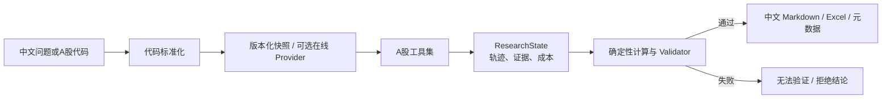

# FinTrace-CN：A股可验证金融研究 Agent

> 面向 A 股研究场景的离线优先金融研究系统：由 Agent 负责理解任务和调用工具，由确定性 Python 引擎负责计算，由 Evidence Ledger 与 Validator 负责证明每个关键结论的来源与正确性。

FinTrace-CN 是在通用金融分析项目基础上完成的 A 股方向二次开发。它不把大模型生成的数字当作事实，也不把一次“看起来合理”的回答当作研究结论；系统通过版本化数据快照、研究时点控制、证据链、确定性估值和结论闸门，构建可复现、可审计的 A 股研究闭环。

## 项目定位

**一句话说明：**让 Agent 找数据和组织研究，让 Python 计算估值，让 Validator 拦截不可信结论，让每一项核心数字都能追溯到数据来源、报告期和公式。

项目当前聚焦研究辅助，不提供个性化投资建议，不连接券商账户，不执行交易，也不承诺或预测投资收益。

## 已完成能力

| 能力层 | 当前实现 | 价值 |
|---|---|---|
| A 股标准化 | 中文公司名与沪深京 Canonical Symbol 解析 | 减少代码、市场和名称歧义 |
| 离线优先数据层 | `SnapshotProvider` 读取版本化本地 JSON；Tushare 为可选在线源 | 演示、测试和回归无需网络、代理或 API Key |
| 时点一致性 | `research_as_of` 与 `available_at` 约束财报可用性 | 防止历史研究使用未来披露信息 |
| 财务期间处理 | FY / Q1 / H1 / 9M / TTM 的确定性转换 | 保证指标与同行估值口径一致 |
| 证据链 | Evidence Ledger 记录来源、时间、期间、单位、字段及计算依赖 | 关键事实和计算可回溯 |
| 确定性估值 | PE、PB、PS 同行估值；IQR 异常值处理和适用性约束 | 模型不直接计算或改写估值数字 |
| 研究校验 | 单位、币种、期间、复权口径、公式、时点和证据完整性校验 | 不满足条件时阻断确定性结论 |
| Agent 可观测性 | `ResearchPlan`、`ResearchState`、工具轨迹、成本和校验结果 | 可以检查 Agent 真实调用了什么 |
| 评测与消融 | 离线基准、四组消融、回归阈值与 CI 工件 | 用指标而非主观观感评估能力 |
| 中文研究产物 | 中文 Markdown 报告、Excel 同行估值与校验页、元数据 | 面向国产化 A 股研究流程输出 |
| A 股每日复盘 | 离线市场全景/热点复盘、板块/资金/涨停梯队、确定性 gate 闸门 | 默认离线可复现，synthetic_demo 明确标注，绝不冒充实时行情 |

## 系统工作流



信任边界明确如下：LLM 只能选择已注册工具并生成受约束的解释性文字；它不拥有数据源选择、证据创建、财务计算或 Validator 决策权。工具返回内容与外部数据均按不可信数据处理，而不是执行指令。

## 快速开始

### 运行环境

- Python 3.11+
- Windows / macOS / Linux
- 离线演示不需要 Tushare Token、网络或大模型 Key

```powershell
git clone <你的仓库地址>
cd stock-analyst
python -m venv .venv
.\.venv\Scripts\Activate.ps1
pip install -r requirements.txt
```

### 一键生成离线中文报告

以下命令使用固定的贵州茅台快照生成中文 Markdown、Excel 和元数据；不会调用 Yahoo、Tushare 或 LLM。

```powershell
.\.venv\Scripts\python.exe scripts\generate_cn_full_report.py `
  --snapshot data\snapshots\cn\600519.SH_20260810_tushare_v1.json `
  --output output\demo\600519
```

产物包括：

- `output/demo/600519/600519.SH_research_report.md`：中文、可追溯研究报告；
- `output/demo/600519/*.xlsx`：同行估值与校验工作簿；
- `output/demo/600519/600519.SH_cn_report.metadata.json`：研究时点、快照、校验和产物元数据。

### 运行离线质量检查

```powershell
python -m pytest -q -m "not integration" -p no:cacheprovider

# 运行零成本的 Agent 消融实验
python scripts/run_agent_ablation.py --dry-run --output output/agent_ablation
```

在线 Tushare 冒烟测试属于集成测试，仅在明确配置 `TUSHARE_TOKEN` 后执行：

```powershell
pytest -m integration -v
```

## 研究报告的可验证性

每份离线报告会明确标记数据为历史版本化快照，而非实时行情；报告中保留 `research_as_of`、`snapshot_id`、Evidence ID 和 Validator 结果。典型校验规则包括：

1. 财报披露时间不得晚于研究截止时间；
2. 市值与同行估值使用 RAW（不复权）价格；
3. TTM 由确定性期间引擎从已披露报表推导；
4. 货币、单位、期间口径和公式必须一致；
5. 结论依赖的 Evidence ID 必须来自本次成功工具调用并登记在 `ResearchState` 中；
6. 银行等金融机构不被静默套用通用企业估值方法。

当任一关键条件不成立时，`ResearchGateValidator` 会输出“无法验证/拒绝结论”，而不是生成貌似精确的结论。

## 当前估值范围

当前 FinTrace-CN 的可验证同行估值支持：

| 方法 | 输入基础 | 限制 |
|---|---|---|
| PE | RAW 价格、总股本、TTM 归母净利润 | 剔除非正利润样本 |
| PB | RAW 价格、总股本、账面权益 | 受实体类型适用性约束 |
| PS | RAW 价格、总股本、同口径营业收入 | 目标与同行期间必须一致 |

IQR 规则会处理异常同行样本，同行覆盖不足时会降低置信等级。EV/EBITDA 及与 DCF 的可验证交叉校验仍属后续扩展；仓库中保留的原有 Excel DCF 能力不应被误表述为已通过 FinTrace-CN 同等证据与校验约束的结果。

## 项目结构

```text
stock-analyst/
├── data/snapshots/cn/          # 版本化A股快照
├── data/snapshots/market/      # 版本化市场复盘快照
├── output/                     # 本地生成报告与评测工件（不应提交原始数据）
├── scripts/
│   ├── generate_cn_full_report.py
│   ├── run_benchmark.py
│   ├── run_ablation.py
│   ├── run_agent_ablation.py
│   └── collect_daily_review.py   # 每日复盘快照采集 CLI
├── src/cn/
│   ├── providers/              # Snapshot / Tushare 与统一 Provider 合约
│   ├── daily_review/           # 每日复盘：schema/provider/collector/analysis/gate
│   ├── symbols.py              # A股代码标准化
│   ├── periods.py              # 财报期间与 TTM
│   ├── evidence.py             # Evidence Ledger
│   ├── valuation.py            # 确定性估值
│   ├── research.py             # ResearchPlan / ResearchState
│   └── report.py               # 中文离线报告渲染
├── src/validation/             # 研究结论闸门
├── tests/                      # 离线回归与 Provider 合约测试
├── ARCHITECTURE.md             # 中文架构说明
├── DATA_SOURCES.md             # 中文数据来源与口径
├── VALUATION_METHODOLOGY.md    # 中文估值方法论
├── EVALUATION.md               # 中文评测说明
├── LIMITATIONS.md              # 中文限制与边界
├── 每日复盘模块.md              # 每日复盘模块：口径与边界
└── 前端UI与数据可视化设计方案.md # 下一阶段实施方案
```

## 评测与复现

评测默认离线执行。基准任务会保留工具调用轨迹、证据 ID、最终校验、延迟、成本、模型参数、Prompt 哈希、快照 ID 与 Git 提交信息。四组 Agent 消融使用相同的案例、模型、温度和最大步数，对比：

| 配置 | 工具 | 证据 | Validator 闸门 |
|---|---|---|---|
| `direct_llm` | 无 | 无 | 无 |
| `agent_tools` | 有 | 剥离 | 无 |
| `agent_tools_evidence` | 有 | 有 | 无 |
| `agent_tools_evidence_validator` | 有 | 有 | 有 |

详细命令和指标定义见 [EVALUATION.md](EVALUATION.md)。

## 下一阶段：前端 UI 与数据可视化

后端研究闭环已具备，下一优先级是将证据、时点、校验与估值过程变成可阅读、可追溯、可操作的研究工作台。设计原则是“先让可信度可见，再做视觉美化”。

首期应包含研究总览、K 线与财务趋势、估值对比、证据链抽屉、Agent 执行轨迹和校验中心；每个图表都必须显示数据来源、研究时点、单位及快照/实时状态。完整信息架构、交互、接口与分期计划见 [前端UI与数据可视化设计方案.md](前端UI与数据可视化设计方案.md)。

## A股每日复盘模块（daily-review）

离线优先、可验证的 A 股每日市场复盘。覆盖**全景复盘**（指数收盘、市场特征、个股动态、核心驱动、领涨领跌、偏离复盘）与**热点复盘**（板块排行、热门板块、成交额榜、净流入榜、涨停梯队），所有关键数字写入 Evidence Ledger，结论经确定性 `review_gate` 闸门校验。

关键边界：

- 默认走本地版本化快照，**离线即可演示与回归**，无需 Tushare Token、网络或大模型 Key；
- `collect_daily_review(..., live=True)` 实时采集失败时，**一律回退到明确标注 `synthetic_demo` 的快照**（`provider="synthetic_demo"`、`data_quality="illustrative_test_fixture_not_for_research"`），**绝不冒充实时行情**；
- 未覆盖章节（如次日推断、宏观快照、板块 5 日、10 日涨幅榜）明确标注「未覆盖」，不编造数字；
- `review_gate` 缺失关键指数/时间戳 → `blocked`；`synthetic_demo` → `warning`（不阻断，但不可用于实盘）。

运行方式：

```powershell
# 1) 离线 CLI 生成快照
.\.venv\Scripts\python.exe scripts\collect_daily_review.py --review-date 20260814

# 2) Streamlit 工作台 → 左侧导航「每日复盘」
.\.venv\Scripts\python.exe -m streamlit run workbench.py
```

API：`GET /api/daily-review`、`/{id}/summary`、`/{id}/panorama`、`/{id}/hotspots`、`POST /api/daily-review/acquire`。完整口径、目录与边界见 [每日复盘模块.md](每日复盘模块.md)。

## 文档导航

- [架构说明](ARCHITECTURE.md)
- [数据来源与口径](DATA_SOURCES.md)
- [估值方法论](VALUATION_METHODOLOGY.md)
- [评测与消融实验](EVALUATION.md)
- [限制、合规与免责声明](LIMITATIONS.md)
- [每日复盘模块：口径与边界](每日复盘模块.md)
- [一个月二次开发方案 v2.0](FinTrace-CN_A股可验证金融研究Agent_一个月二次开发方案_v2.0.md)
- [前端 UI 与数据可视化设计方案](前端UI与数据可视化设计方案.md)

## 免责声明

本项目仅用于金融研究、工程实践与教育目的，不构成证券、基金或任何金融产品的投资建议。历史快照并非实时行情；即使 Validator 通过，也仅表示已捕获输入和规则在既定口径下通过检查，不代表证券适合任何投资者，亦不保证未来收益。
